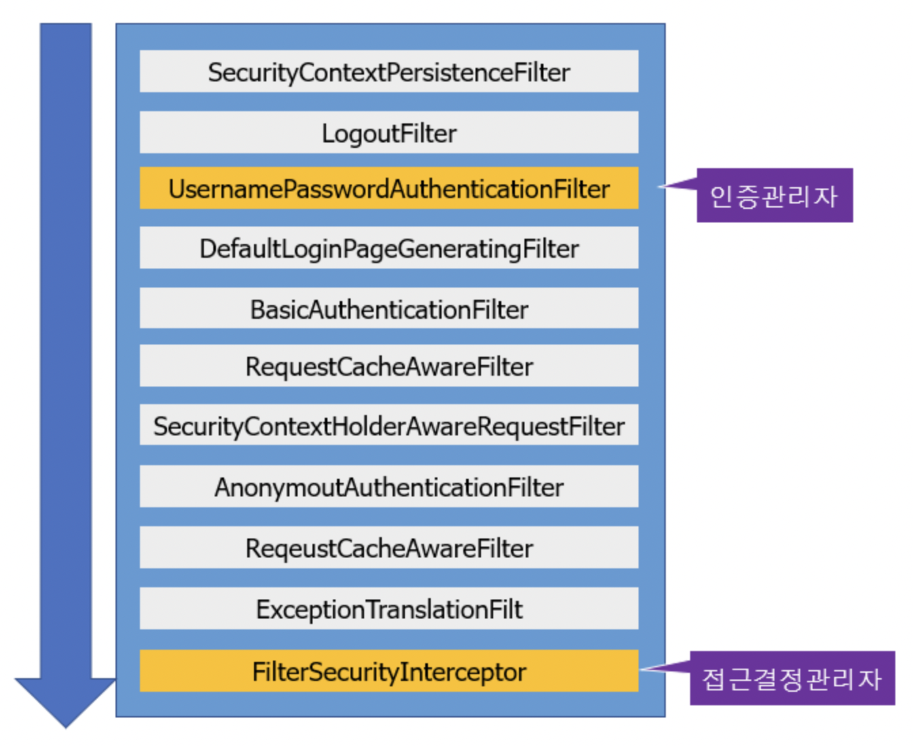
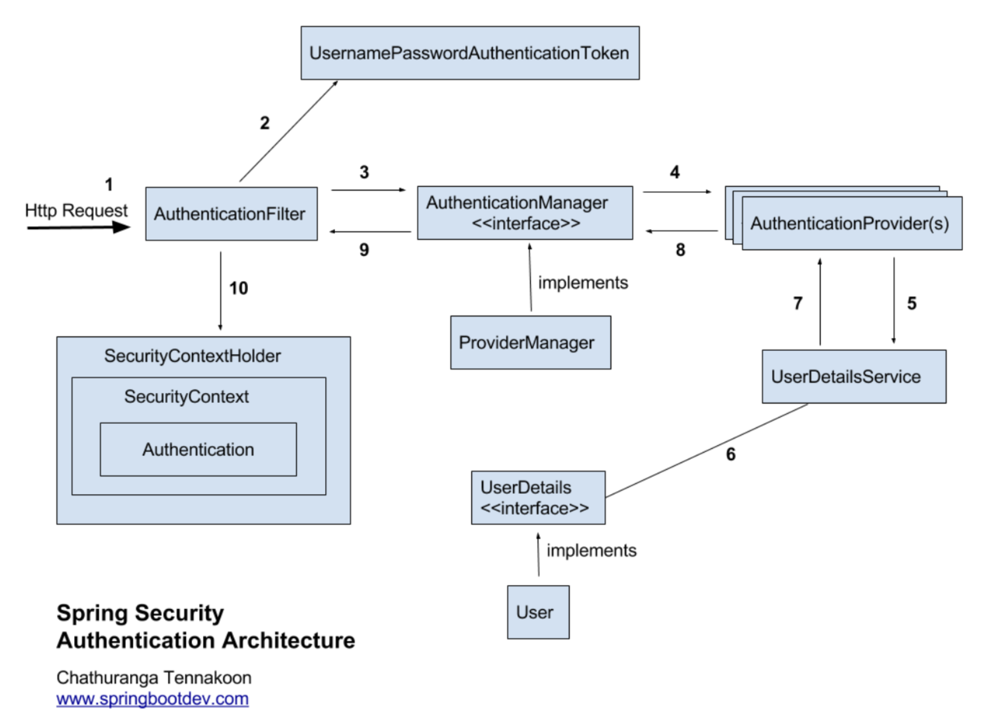

# Spring security 구조와 흐름


### Spring Security 개념 
Spring Security란?
>Spring Security란 보안 솔루션을 제공해주는 Spring 기반의 스프링 하위 프레임워크
Spring Security는 '인증'과 '권한'에 대한 부분을 Filter 흐름에 따라 처리하고 있다.
***

### 인증과 권한
>인증(Authentication)은 자신이 '누구'라고 주장하는 사람을 정말 '누구'가 맞는지 확인하는 작업, 권한은 특정 부분에 접근할 수 있는지에 대한 여부를 확인하는 작업을 의미한다. 
***


## spring security 필터들


- `SecurityContextPersistenceFilter` : SecurityContextRepository에서 SecurityContext를 로드하고 저장하는 일을 담당함
- `LogoutFilter` : 로그아웃 URL로 지정된 가상URL에 대한 요청을 감시하고 매칭되는 요청이 있으면 사용자를 로그아웃시킴
- `UsernamePasswordAuthenticationFilter` : 사용자명과 비밀번호로 이뤄진 폼기반 인증에 사용하는 가상 URL요청을 감시하고 요청이 있으면 사용자의 인증을 진행함
- `DefaultLoginPageGeneratingFilter` : 폼기반 또는 OpenID 기반 인증에 사용하는 가상URL에 대한 요청을 감시하고 로그인 폼 기능을 수행하는데 필요한 HTML을 생성함
- `BasicAuthenticationFilter` : HTTP 기본 인증 헤더를 감시하고 이를 처리함
- `RequestCacheAwareFilter` : 로그인 성공 이후 인증 요청에 의해 가로채어진 사용자의 원래 요청을 재구성하는데 사용됨
- `SecurityContextHolderAwareRequestFilter` : HttpServletRequest를 HttpServletRequestWrapper를 상속하는 하위 클래스(SecurityContextHolderAwareRequestWrapper)로 감싸서 필터 체인상 하단에 위치한 요청 프로세서에 추가 컨텍스트를 제공함
- `AnonymousAuthenticationFilter` : 이 필터가 호출되는 시점까지 사용자가 아직 인증을 받지 못했다면 요청 관련 인증 토큰에서 사용자가 익명 사용자로 나타나게 됨
- `SessionManagementFilter` : 인증된 주체를 바탕으로 세션 트래킹을 처리해 단일 주체와 관련한 모든 세션들이 트래킹되도록 도움
- `ExceptionTranslationFilter` : 이 필터는 보호된 요청을 처리하는 동안 발생할 수 있는 기대한 예외의 기본 라우팅과 위임을 처리함
- `FilterSecurityInterceptor` : 이 필터는 권한부여와 관련한 결정을 AccessDecisionManager에게 위임해 권한부여 결정 및 접근 제어 결정을 쉽게 만들어 줌

> ### 정적 자원을 제공하는 클래스를 생성

```java
@Configuration
public class WebMvcConfig implements WebMvcConfigurer {

    private static final String[] CLASSPATH_RESOURCE_LOCATIONS = { "classpath:/static/", "classpath:/public/", "classpath:/",
            "classpath:/resources/", "classpath:/META-INF/resources/", "classpath:/META-INF/resources/webjars/" };

    @Override
    public void addViewControllers(ViewControllerRegistry registry) {
        // /에 해당하는 url mapping을 /common/test로 forward한다.
        registry.addViewController( "/" ).setViewName( "forward:/index" );
        // 우선순위를 가장 높게 잡는다.
        registry.setOrder(Ordered.HIGHEST_PRECEDENCE);
    }

    @Override
    public void addResourceHandlers(ResourceHandlerRegistry registry) {
        registry.addResourceHandler("/**").addResourceLocations(CLASSPATH_RESOURCE_LOCATIONS);
    }

}
```

>### 그리고 SpringSecurity에 대한 기본적인 설정들을 추가한다. 

SpringSecurity에 대한 설정 클래스에서는
1. configure 메소드를 통해 정적 자원들에 대해서는 Security를 적용하지 않음을 추가한다.
2. configure 메소드를 통해 어떤 요청에 대해서는 로그인을 요구하고, 어떤 요청에 대해서 로그인을 요구하지 않을지 설정한다.
3. form 기반의 로그인을 활용하는 경우 로그인 URL, 로그인 성공시 전달할 URL, 로그인 실패 URL 등에 대해서 설정한다.
```java
@Configuration
@EnableWebSecurity
public class WebSecurityConfig extends WebSecurityConfigurerAdapter {

    // 정적 자원에 대해서는 Security 설정을 적용하지 않음.
    @Override
    public void configure(WebSecurity web) {
        web.ignoring().requestMatchers(PathRequest.toStaticResources().atCommonLocations());
    }

    @Override
    protected void configure(HttpSecurity http) throws Exception {
        http.csrf().disable().authorizeRequests()
                // /about 요청에 대해서는 로그인을 요구함
                .antMatchers("/about").authenticated()
                // /admin 요청에 대해서는 ROLE_ADMIN 역할을 가지고 있어야 함
                .antMatchers("/admin").hasRole("ADMIN")
                // 나머지 요청에 대해서는 로그인을 요구하지 않음
                .anyRequest().permitAll()
                .and()
                // 로그인하는 경우에 대해 설정함
            .formLogin()
                // 로그인 페이지를 제공하는 URL을 설정함
                .loginPage("/user/loginView")
                // 로그인 성공 URL을 설정함
                .successForwardUrl("/index")
                // 로그인 실패 URL을 설정함
                .failureForwardUrl("/index")
                .permitAll()
                .and()
                .addFilterBefore(customAuthenticationFilter(), UsernamePasswordAuthenticationFilter.class);
    }

    @Bean
    public BCryptPasswordEncoder bCryptPasswordEncoder() {
        return new BCryptPasswordEncoder();
    }

}
```
> /about 에 대해서는 로그인이 성공한 경우에만 접근가능하고, /admin에 대해서는 로그인 후에 ROLE_ADMIN 역할을 갖고 있는 경우에만 접근가능하도록 설정한 것이다.




## 1. Authentication : 실질적으로 인증정보를 담고 있는 객체
- `Principal`
    - '내가 누구인지'에 대한 정보를 담은 객체
    - 로그인_ID에 해당하는 값을 담고 있다.
- `Credentials`
    - 인증자격에 대한 정보를 담은 객체
    - 비밀번호와 같은 암호 값을 담고 있다.
- `Authorities`
    - 현재 유저의 권한(ROLE)정보를 담은 객체


- 모든 접근 주체(=유저) 는 Authentication 를 생성하는데 이것은 `SecurityContext` 에 보관되고 사용

- 현재 접근하는 주체의 정보와 권한을 담는 인터페이스이다. 
Authentication 객체는 SecurityContext에 저장되며,
- SecurityContextHolder를 통해 SecurityContext에 접근하고, SecurityContext를 통해 Authentication에 접근할 수 있다.

```java
public interface Authentication extends Principal, Serializable {
    Collection<? extends GrantedAuthority> getAuthorities(); // Authentication 저장소에 의해 인증된 사용자의 권한 목록
    Object getCredentials(); // 주로 비밀번호
    Object getDetails(); // 사용자 상세정보
    Object getPrincipal(); // 주로 ID
    boolean isAuthenticated(); //인증 여부
    void setAuthenticated(boolean isAuthenticated) throws IllegalArgumentException;
}
```

## 2.  UsernamePasswordAuthenticationToken
> 전송이 오면 AuthenticationFilter로 요청이 먼저 오게 되고, 아이디와 비밀번호를 기반으로 UserPasswordAuthenticationToken을 발급해주어야 한다.
- UsernamePasswordAuthenticationToken은 Authentication을 implements한 AbstractAuthenticationToken의 하위 클래스로, 
- User의 ID가 Principal 역할을 하고, Password가 Credential의 역할을 한다. 
- UsernamePasswordAuthenticationToken의 첫 번째 생성자는 인증 전의 객체를 생성하고, 두번째는 인증이 완료된 객체를 생성한다.

```java
public abstract class AbstractAuthenticationToken implements Authentication, CredentialsContainer {
}
 
public class UsernamePasswordAuthenticationToken extends AbstractAuthenticationToken {
 
	private static final long serialVersionUID = SpringSecurityCoreVersion.SERIAL_VERSION_UID;
 
	// 주로 사용자의 ID에 해당
	private final Object principal;
 
	// 주로 사용자의 PW에 해당
	private Object credentials;
 
	// 인증 완료 전의 객체 생성
	public UsernamePasswordAuthenticationToken(Object principal, Object credentials) {
		super(null);
		this.principal = principal;
		this.credentials = credentials;
		setAuthenticated(false);
	}
 
	// 인증 완료 후의 객체 생성
	public UsernamePasswordAuthenticationToken(Object principal, Object credentials,
			Collection<? extends GrantedAuthority> authorities) {
		super(authorities);
		this.principal = principal;
		this.credentials = credentials;
		super.setAuthenticated(true); // must use super, as we override
	}
}
```

## 3. AuthenticationManager

>인증에 대한 부분은 AuthenticationManager를 통해서 처리하게 되는데, 실질적으로는 AuthenticationManager에등록된 AuthenticationProvider에의해 처리된다.
인증에 성공하면 두번째 생성자를 이용해 객체를 생성하여 SecurityContext에 저장한다.

- 인증 처리 관련 인터페이스
- `authenticate(Authentication authentication)` 메서드를 통해 인증을 구현한다.

```java
public interface AuthenticationManager {
    Authentication authenticate(Authentication      authentication) throws AuthenticationException;
}
```
## 4. AuthenticationProvider
- AuthenticationProvider에서는 실제 인증에 대한 부분을 처리하는데, 인증 전의 Authentication 객체를 받아서 인증이 완료된 객체를 반환하는 역할을 한다. 
- 아래와 같은 인터페이스를 구현해 Custom한 AuthenticationProvider를 작성하고 AuthenticationManager에 등록하면 된다.


```java
public interface AuthenticationProvider {

Authentication authenticate(Authentication authentication) throws AuthenticationException;

boolean supports(Class<?> authentication);
}
```

## 5. ProviderManager

- `AuthenticationManager`의 구현체
- 실제 인증을 처리한다.

> AuthenticationManager를 implements한 ProviderManager는 AuthenticationProvider를 구성하는 목록을 갖는다.

```java
public class ProviderManager implements AuthenticationManager, MessageSourceAware, InitializingBean {

public List<AuthenticationProvider> getProviders() {
	return this.providers;
}

public Authentication authenticate(Authentication authentication) throws AuthenticationException {
	Class<? extends Authentication> toTest = authentication.getClass();
	AuthenticationException lastException = null;
	AuthenticationException parentException = null;
	Authentication result = null;
	Authentication parentResult = null;
	int currentPosition = 0;
	int size = this.providers.size();

    // for문으로 모든 provider를 순회하여 처리하고 result가 나올때까지 반복한다.
	for (AuthenticationProvider provider : getProviders()) { ... }
    }
}
```

## 6. UserDetailsService
>UserDetailsService는 UserDetails 객체를 반환하는 하나의 메소드만을 가지고 있는데, 일반적으로 이를 implements한 클래스에 UserRepository를 주입받아 DB와 연결하여 처리한다.

- UserdetailsService 은 데이터베이스에서 유저 정보를 불러와서 UserDetails 객체를 만들어 돌려주는 역할을 한다.
- UserDetailsService 보다는 UserDetails 가 핵심인 듯 한데, 왜냐하면 UserDetails 객체를 만드는 이유가 권한(GrantedAuthority)이 부여된 객체를 생성하도록 강제하기 때문이다.

- 즉, Provider 는 UserDetails 구현체(User) 를 사용함으로써 해당 유저의 권한을 참조가능하게 된다.


```java
public interface UserDetailsService {
UserDetails loadUserByUsername(String username) throws UsernameNotFoundException;
}
```

## 7. UserDetails
>인증에 성공하여 생성된 UserDetails 객체는 Authentication객체를 구현한 UsernamePasswordAuthenticationToken을 생성하기 위해 사용된다. UserDetails를 implements하여 처리할 수 있다.


```java
public interface UserDetails extends Serializable {

// 권한 목록
Collection<? extends GrantedAuthority> getAuthorities();

String getPassword();

String getUsername();

// 계정 만료 여부
boolean isAccountNonExpired();

// 계정 잠김 여부
boolean isAccountNonLocked();

// 비밀번호 만료 여부
boolean isCredentialsNonExpired();

// 사용자 활성화 여부
boolean isEnabled();
}
```

## 8. SecurityContextHolder : 시큐리티가 최종적으로 제공하는 객체
>SecurityContextHolder는 보안 주체의 세부 정보를 포함하여 응용프로그램의 현재 보안 컨텍스트에 대한 세부 정보가 저장된다.


## 9. SecurityContext
>Authentication을 보관하는 역할을 하며, SecurityContext를 통해 Authentication을 저장하거나 꺼내올 수 있다.

인증에 대한 정보는 `Authentication`객체에 있다.
하지만 시큐리티는 최종적으로 `SecurityContextHolder`를 통해 이를 제공하는데, 그 이유는??

**Thread-local** `SecurityContextHolder`는 `SecurityContext`객체를 Thread-local로 제공,같은 스레드에서는 매개로 주고받지 않아도 언제든지 인증정보에 접근할 수 있다!

```java
SecurityContextHolder.getContext().setAuthentication(authentication);

SecurityContextHolder.getContext().setAuthentication(authentication);
```

***
시큐리티는 인증에 대한 요청/결과 값을 Authentication 객체에 담아 처리한다.

하지만 인증에 대한 결과정보는 최종적으로 SecurityContextHolder 객체로 감싸져 제공되는데, SecurityContextHolder는 내부의 SecurityContext(Authentication) 객체를 Thread-local로 제공, 같은 스레드에서는 SecurityContextHolder를 통해 어디서든 인증정보에 접근이 가능하다.
***

## 10. GrantedAuthority
> GrantedAuthority는 현재 사용자(Principal)가 가지고 있는 권한을 의미하며, ROLE_ADMIN이나 ROLE_USER와 같이 ROLE_*의 형태로 사용한다. GrantedAuthority 객체는 UserDetailsService에 의해 불러올 수 있고, 특정 자원에 대한 권한이 있는지를 검사하여 접근 허용 여부를 결정한다.

***

## * 스프링 시큐리티 구조의 처리 과정 정리 *
1. 사용자가 로그인 정보와 함께 인증 요청을 한다.(Http Request)
2.  AuthenticationFilter가 요청을 가로채고, 가로챈 정보를 통해 UsernamePasswordAuthenticationToken의 인증용 객체를 생성한다.

3. AuthenticationManager의 구현체인 ProviderManager에게 생성한 UsernamePasswordToken 객체를 전달한다.
4. AuthenticationManager는 등록된 AuthenticationProvider(들)을 조회하여 인증을 요구한다.
5. 실제 DB에서 사용자 인증정보를 가져오는 UserDetailsService에 사용자 정보를 넘겨준다.
6. 넘겨받은 사용자 정보를 통해 DB에서 찾은 사용자 정보인 UserDetails 객체를 만든다.
7. AuthenticationProvider(들)은 UserDetails를 넘겨받고 사용자 정보를 비교한다.
8. 인증이 완료되면 권한 등의 사용자 정보를 담은 Authentication 객체를 반환한다.
9. 다시 최초의 AuthenticationFilter에 Authentication 객체가 반환된다.
10. Authenticaton 객체를 SecurityContext에 저장한다.
