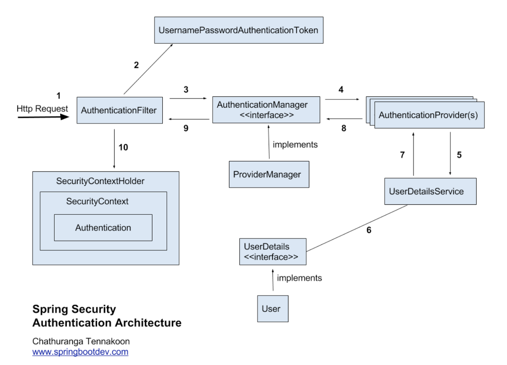
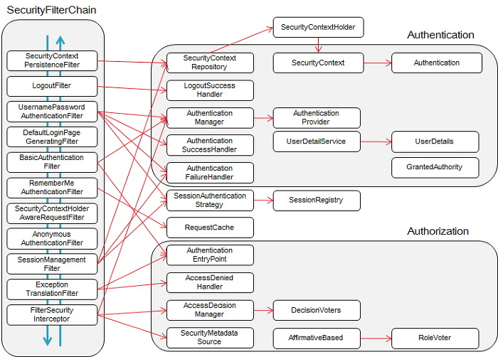

## Spring Security란?
* Spring 기반의 어플리케이션의 보안(인증과 권한, 인가 등)을 담당하는 스프링 하위 프레임워크
* 보안과 관련해서 체계적으로 많은 옵션을 제공해주기 때문에, 개발자가 일일이 보안 관련 로직을 작성하지 않아도 됨
* '인증'과 '권한'에 대한 부분을 Filter 흐름에 따라 처리

## Spring Security의 구조와 흐름

1. 사용자가 로그인 정보와 함께 인증 요청 ➜ Http Request
2. AuthenticationFilter가 요청을 가로채고, 가로챈 정보를 통해 UsernamePasswordAuthenticationToken의 인증용 객체 생성
3. AuthenticationManager의 구현체인 ProviderManager에게 생성한 UsernamePasswordToken 객체 전달
4. AuthenticationManager는 등록된 AuthenticationProvider들을 조회하여 인증 요구
5. 실제 DB에서 사용자 인증정보를 가져오는 UserDetailsService에 사용자 정보를 넘겨줌
6. 넘겨받은 사용자 정보를 통해 DB에서 찾은 사용자 정보인 UserDetails 객체를 만듦
7. AuthenticationProvider들은 UserDetails를 넘겨받고 사용자 정보를 비교
8. 인증이 완료되면 권한 등의 사용자 정보를 담은 Authentication 객체 반환
9. 다시 최초의 AuthenticationFilter에 Authentication 객체가 반환됨
10. Authenticaton 객체를 SecurityContext에 저장

## Spring Security 구조에 따른 주요 모듈

**Authentication**
* 현재 접근하는 주체의 정보와 권한을 담는 인터페이스
* Authentication 객체는 SecurityContext에 저장되며, SecurityContextHolder를 통해 SecurityContext에 접근하고, SecurityContext를 통해 Authentication에 접근할 수 있음

**UsernamePasswordAuthenticationToken**
* Authentication을 implements한 AbstractAuthenticationToken의 하위 클래스
* User의 ID가 Principal 역할을 하고, Password가 Credential의 역할을 함
* UsernamePasswordAuthenticationToken의 첫 번째 생성자는 인증 전의 객체를 생성하고, 두번째는 인증이 완료된 객체를 생성

**AuthenticationManager**
* 인증에 대한 부분은 AuthenticationManager를 통해서 처리
* 실질적으로는 AuthenticationManager에등록된 AuthenticationProvider에 의해 처리
* 인증에 성공하면 두번째 생성자를 이용해 객체를 생성하여 SecurityContext에 저장

**AuthenticationProvider**
* 실제 인증에 대한 부분을 처리
* 인증 전의 Authentication 객체를 받아서 인증이 완료된 객체를 반환하는 역할

**ProviderManager**
* AuthenticationManager를 implements한 ProviderManager는 AuthenticationProvider를 구성하는 목록을 가짐

**UserDetailsService**
* UserDetailsService는 UserDetails 객체를 반환하는 하나의 메소드만을 가짐
* 일반적으로 이를 implements한 클래스에 UserRepository를 주입받아 DB와 연결하여 처리

**UserDetails**
* 인증에 성공하여 생성된 UserDetails 객체는 Authentication객체를 구현한 UsernamePasswordAuthenticationToken을 생성하기 위해 사용됨
* UserDetails를 implements하여 처리할 수 있음

**SecurityContextHolder**
* 보안 주체의 세부 정보를 포함하여 응용프로그램의 현재 보안 컨텍스트에 대한 세부 정보 저장

**SecurityContext**
* Authentication을 보관하는 역할
* SecurityContext를 통해 Authentication을 저장하거나 꺼내올 수 있음

**GrantedAuthority**
* 현재 사용자(Principal)가 가지고 있는 권한을 의미
* ROLE_ADMIN이나 ROLE_USER와 같이 ROLE_*의 형태로 사용
* GrantedAuthority 객체는 UserDetailsService에 의해 불러올 수 있고, 특정 자원에 대한 권한이 있는지를 검사하여 접근 허용 여부를 결정함